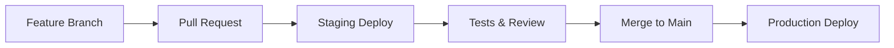

# Guía de Despliegue a Producción

## 🚀 Configuración Completa de CI/CD

### Arquitectura de Despliegue

```
┌─────────────────┐    ┌──────────────────┐    ┌─────────────────┐
│   GitHub Repo   │───▶│  GitHub Actions  │───▶│     Netlify     │
│                 │    │      CI/CD       │    │   Production    │
└─────────────────┘    └──────────────────┘    └─────────────────┘
                              │
                              ▼
                       ┌──────────────────┐
                       │   Lighthouse     │
                       │   Performance    │
                       │     Audit        │
                       └──────────────────┘
```

## 📋 Checklist de Configuración

### 1. **Configuración de GitHub Secrets**

Configura estos secrets en tu repositorio de GitHub (`Settings > Secrets and variables > Actions`):

```bash
# Netlify Configuration
NETLIFY_AUTH_TOKEN=your_netlify_auth_token
NETLIFY_SITE_ID=your_production_site_id
NETLIFY_STAGING_SITE_ID=your_staging_site_id

# Firebase Configuration
VITE_FIREBASE_API_KEY=your_firebase_api_key
VITE_FIREBASE_AUTH_DOMAIN=your_project.firebaseapp.com
VITE_FIREBASE_PROJECT_ID=your_project_id
VITE_FIREBASE_STORAGE_BUCKET=your_project.appspot.com
VITE_FIREBASE_MESSAGING_SENDER_ID=123456789
VITE_FIREBASE_APP_ID=1:123456789:web:abcdef
VITE_FIREBASE_MEASUREMENT_ID=G-XXXXXXXXXX
```

### 2. **Configuración de Netlify**

#### Crear Sitio en Netlify:
1. Conecta tu repositorio de GitHub
2. Configura build settings:
   - **Build command**: `npm run build`
   - **Publish directory**: `dist`
   - **Node version**: `18`

#### Variables de Entorno en Netlify:
```bash
NODE_VERSION=18
NPM_FLAGS=--production=false
VITE_APP_ENV=production
```

### 3. **Configuración de Dominio Personalizado**

#### En Netlify Dashboard:
1. Ve a `Site settings > Domain management`
2. Agrega tu dominio personalizado
3. Configura DNS records:

```dns
# DNS Configuration
Type    Name    Value
A       @       75.2.60.5
CNAME   www     your-site.netlify.app
```

#### Certificado SSL:
- Se configura automáticamente con Let's Encrypt
- Fuerza HTTPS en `netlify.toml`

## 🔄 Flujo de Despliegue

### Desarrollo → Staging → Producción



### Triggers de Despliegue:

1. **Pull Request** → Deploy a Staging
2. **Merge to Main** → Deploy a Production
3. **Manual Trigger** → Deploy específico

## 🧪 Pipeline de CI/CD

### Etapas del Pipeline:

#### 1. **Test Stage**
```yaml
- Linting (ESLint)
- Type checking (TypeScript)
- Unit tests (Vitest)
- E2E tests (Cypress)
```

#### 2. **Build Stage**
```yaml
- Install dependencies
- Create production env file
- Build application
- Generate bundle analysis
- Upload artifacts
```

#### 3. **Audit Stage** (PR only)
```yaml
- Lighthouse performance audit
- PWA compliance check
- Accessibility testing
- SEO analysis
```

#### 4. **Deploy Stage**
```yaml
- Deploy to Netlify
- Update deployment status
- Send notifications
```

## 📊 Monitoreo de Producción

### Métricas Automáticas:

#### Web Vitals:
- **CLS** (Cumulative Layout Shift)
- **INP** (Interaction to Next Paint)
- **FCP** (First Contentful Paint)
- **LCP** (Largest Contentful Paint)
- **TTFB** (Time to First Byte)

#### Error Tracking:
- JavaScript errors
- Promise rejections
- Console errors
- Network failures

#### Uptime Monitoring:
- Health checks cada minuto
- Alertas automáticas
- Historial de disponibilidad

### Dashboard de Monitoreo:

```typescript
import { productionMonitor } from './utils/monitoring';

// Obtener resumen de métricas
const summary = productionMonitor.getMonitoringSummary();

// Métricas disponibles:
// - errors.total, errors.recent
// - uptime.total_checks, uptime.up_percentage
// - performance (Web Vitals summary)
```

## 🚨 Sistema de Alertas

### Configuración de Alertas:

#### Tipos de Alertas:
1. **Error Rate**: > 5 errores en 15 minutos
2. **Performance**: > 25% métricas pobres
3. **Uptime**: < 95% disponibilidad

#### Canales de Notificación:
- Console logging
- Local storage
- Webhooks (configurable)
- Email (configurable)

### Gestión de Alertas:

```typescript
import { alertManager } from './utils/alerts';

// Obtener alertas activas
const activeAlerts = alertManager.getActiveAlerts();

// Reconocer alerta
alertManager.acknowledgeAlert(alertId);

// Resumen de alertas
const summary = alertManager.getAlertSummary();
```

## 🔧 Comandos de Despliegue

### Desarrollo Local:
```bash
# Instalar dependencias
npm install

# Desarrollo
npm run dev

# Build local
npm run build

# Preview build
npm run preview

# Tests
npm run test:unit
npm run test:e2e:headless
```

### Producción:
```bash
# Build optimizado
npm run build:production

# Análisis de bundle
npm run build:analyze

# Linting
npm run lint:fix

# Type checking
npm run type-check
```

## 📈 Optimizaciones de Producción

### Build Optimizations:

#### Chunking Strategy:
```javascript
// vite.config.ts
manualChunks: {
  'react-vendor': ['react', 'react-dom'],
  'mui-core': ['@mui/material', '@mui/system'],
  'firebase-vendor': ['firebase/app', 'firebase/auth'],
  // ... más chunks
}
```

#### Performance Features:
- Lazy loading de rutas
- Code splitting automático
- Tree shaking
- Minificación con Terser
- Compresión gzip/brotli

### PWA Optimizations:
- Service Worker con cache strategies
- Offline functionality
- Install prompt
- Background sync (futuro)

## 🔒 Seguridad en Producción

### Headers de Seguridad:
```
X-Frame-Options: DENY
X-XSS-Protection: 1; mode=block
X-Content-Type-Options: nosniff
Referrer-Policy: strict-origin-when-cross-origin
```

### Variables de Entorno:
- Secrets nunca en código
- Variables específicas por entorno
- Rotación regular de tokens

## 🚀 Proceso de Despliegue Paso a Paso

### 1. **Preparación**
```bash
# 1. Crear feature branch
git checkout -b feature/nueva-funcionalidad

# 2. Desarrollar y testear
npm run dev
npm run test:unit

# 3. Commit con conventional commits
git commit -m "feat: agregar nueva funcionalidad"
```

### 2. **Pull Request**
```bash
# 1. Push branch
git push origin feature/nueva-funcionalidad

# 2. Crear PR en GitHub
# 3. Automáticamente se despliega a staging
# 4. Se ejecutan tests y Lighthouse audit
```

### 3. **Review y Merge**
```bash
# 1. Review del código
# 2. Verificar deploy de staging
# 3. Merge a main
# 4. Deploy automático a producción
```

### 4. **Verificación Post-Deploy**
```bash
# 1. Verificar sitio en producción
# 2. Revisar métricas de performance
# 3. Monitorear errores
# 4. Confirmar funcionalidad PWA
```

## 📱 Verificación PWA

### Checklist Post-Deploy:

#### Lighthouse Audit:
- Performance: > 90
- Accessibility: > 90
- Best Practices: > 90
- SEO: > 90
- PWA: > 90

#### Funcionalidades PWA:
- ✅ Service Worker registrado
- ✅ Manifest válido
- ✅ Iconos disponibles
- ✅ Install prompt funcional
- ✅ Offline functionality
- ✅ Cache strategies activas

### Testing en Dispositivos:

#### Desktop:
- Chrome: Install prompt
- Edge: PWA features
- Firefox: Offline mode

#### Mobile:
- Android: Add to home screen
- iOS: Add to home screen
- PWA shortcuts funcionando

## 🔄 Rollback y Recovery

### Estrategia de Rollback:

#### Rollback Automático:
```yaml
# En caso de fallo en health checks
- Revertir a deploy anterior
- Notificar al equipo
- Investigar causa
```

#### Rollback Manual:
```bash
# 1. Identificar commit estable anterior
git log --oneline

# 2. Crear hotfix branch
git checkout -b hotfix/rollback-to-stable

# 3. Revertir cambios problemáticos
git revert <commit-hash>

# 4. Deploy de emergencia
git push origin hotfix/rollback-to-stable
```

## 📞 Contactos y Escalación

### En caso de problemas:

#### Severidad Critical:
1. Revisar alertas automáticas
2. Verificar uptime monitoring
3. Ejecutar rollback si necesario
4. Notificar stakeholders

#### Recursos de Debug:
- Netlify deploy logs
- GitHub Actions logs
- Browser DevTools
- Lighthouse reports

---

## 🎯 Métricas de Éxito

### KPIs de Despliegue:
- **Deploy Success Rate**: > 95%
- **Deploy Time**: < 10 minutos
- **Rollback Time**: < 5 minutos
- **Uptime**: > 99.9%

### Performance Targets:
- **LCP**: < 2.5s
- **FID/INP**: < 100ms
- **CLS**: < 0.1
- **Bundle Size**: < 1MB gzipped

La configuración está completa y lista para producción con monitoreo automático, alertas inteligentes y despliegue continuo.
